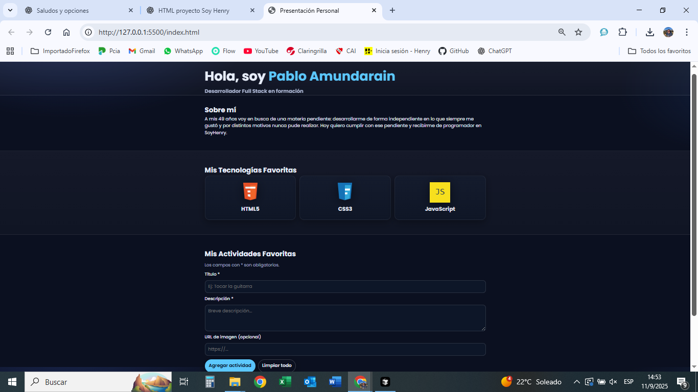

# Proyecto M1 – Portfolio Personal

Este es mi proyecto del **Módulo 1 en Soy Henry**, donde practico **HTML, CSS y JavaScript** creando una página de presentación personal.

## 🌐 Demo Online
👉 [Ver el Portfolio en línea](https://amundarainp.github.io/Proyecto-M1/)

## 📸 Vista previa

## 🔹 Contenido
- **index.html** → estructura principal del sitio.
- **styles/** → hojas de estilo (`reset.css` y `styles.css`).
- **scripts/** → lógica en JavaScript (`index.js`).
- **spec/** → íconos y recursos.

## ✨ Características
- Diseño responsivo con `rem` + media queries.
- Tipografía **Poppins** desde Google Fonts.
- Sección “Sobre mí”.
- Cards de tecnologías (HTML, CSS, JS).
- Formulario dinámico para actividades:
  - Agregar título, descripción e imagen.
  - Guardado automático con `localStorage`.
  - Borrar actividades individuales o limpiar todas.

## 📚 Aprendizajes
- HTML semántico y accesible.
- Uso de variables CSS y grillas responsivas.
- Manejo del DOM con JavaScript.
- Flujo de trabajo con Git y GitHub.
- Publicación con GitHub Pages.

## 🔗 Mis redes
- [GitHub](https://github.com/amundarainp)
- [LinkedIn](https://www.linkedin.com/in/tuusuario/) <!-- Reemplazá con tu URL real -->
